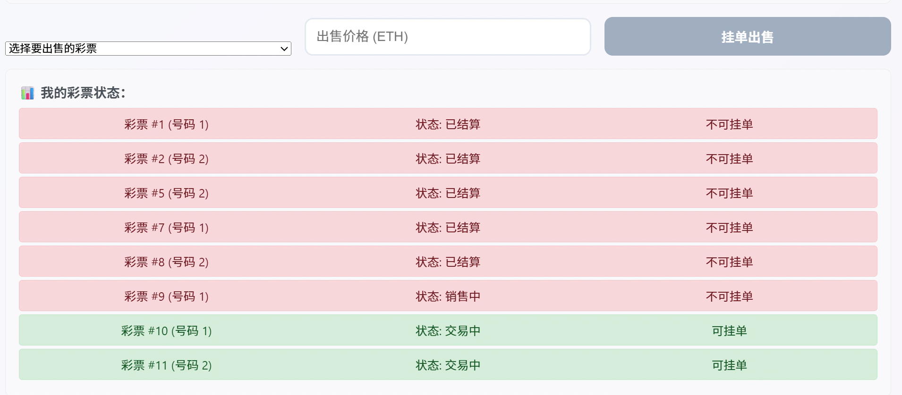
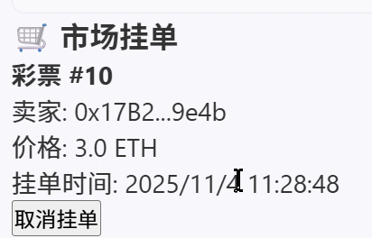

# 🎰 EasyBet 彩票系统

一个基于以太坊的完整彩票DApp，支持彩票购买、玩家交易和管理员结算功能。
因为实验要求里说可以更改部分要求，所以这个彩票系统是赢家获得整个奖池的奖金，而奖池初始是空的，
只有有人购买彩票奖池才会叠加。（主要我觉得这样符合我的认知）。但是这样带来的问题是买家似乎完全没必要
买一张很贵的彩票。当然可以根据彩票价格调整获奖概率，但这里因为是实验，所以彩票中奖是由管理员控制的，
买贵的彩票似乎就成了冤大头，所以一种彩票里的每张设置为等价，价格由管理员在发布彩票时决定。
Bonus做了订单簿

## 屏幕截图






## 项目文档

本项目包含三个README文档，请根据需要查看：

- **[本文件](./README.md)** - 项目总览和运行流程
- **[合约README](./contracts/README.md)** - 智能合约项目结构详解
- **[前端README](./frontend/README.md)** - 前端项目结构详解

## 功能特性

### 核心功能
- **彩票创建**: 管理员可以创建新的彩票期
- **彩票购买**: 玩家可以选择号码购买彩票
- **玩家交易**: 销售结束后，玩家之间可以交易彩票
- **自动结算**: 管理员开奖后，中奖者可以领取奖金
- **NFT支持**: 每张彩票都是独特的NFT

### 彩票状态流程
1. **未开始** → 管理员创建彩票
2. **销售中** → 玩家购买彩票
3. **交易中** → 玩家间交易彩票
4. **已结算** → 开奖并分配奖金

## 使用指南

### 管理员操作

1. **创建彩票**
   - 设置彩票价格（ETH）
   - 设置最大彩票数量
   - 设置销售时长（小时）
   - 添加彩票描述

2. **结束销售**
   - 销售时间到期或售罄后
   - 点击"结束销售"进入交易阶段

3. **结算彩票**
   - 输入中奖号码
   - 系统自动计算奖金分配

### 玩家操作

1. **购买彩票**
   - 选择彩票期
   - 输入想要的号码（1-最大数量）
   - 支付对应ETH

2. **交易彩票**
   - 在交易阶段
   - 输入彩票ID、接收者地址、交易价格
   - 完成交易

3. **领取奖金**
   - 彩票结算后
   - 中奖者可以领取奖金

## 合约架构

### 主要结构

```solidity
struct Lottery {
    uint256 lotteryId;
    uint256 ticketPrice;
    uint256 maxTickets;
    uint256 soldTickets;
    uint256 totalPrizePool;
    uint256 winningNumber;
    uint256[] winningTickets;
    LotteryState state;
    uint256 startTime;
    uint256 endTime;
    uint256 settleTime;
    string description;
}

struct Ticket {
    uint256 ticketId;
    uint256 lotteryId;
    uint256 number;
    address owner;
    uint256 purchasePrice;
    uint256 purchaseTime;
    bool isWinning;
}
```

### 核心函数

- `createLottery()` - 创建新彩票
- `buyTicket()` - 购买彩票
- `tradeTicket()` - 交易彩票
- `endSales()` - 结束销售
- `settleLottery()` - 结算彩票
- `claimPrize()` - 领取奖金

## 项目结构

```
dcx/
├── contracts/              # 智能合约项目
│   ├── contracts/         # 合约源码
│   │   └── EasyBet.sol   # 主合约
│   ├── scripts/           # 部署脚本
│   │   └── deploy.ts     # 部署脚本
│   ├── test/             # 测试文件
│   │   └── testEasyBet.ts
│   ├── artifacts/        # 编译输出（自动生成）
│   ├── cache/            # 缓存（自动生成）
│   ├── typechain-types/  # TypeScript类型（自动生成）
│   ├── hardhat.config.ts # Hardhat配置
│   ├── package.json      # 依赖配置
│   └── README.md         # 合约项目文档
└── frontend/             # React前端项目
    ├── src/              # 源代码
    │   ├── App.tsx       # 主应用组件
    │   ├── App.css       # 样式文件
    │   ├── contracts/    # 合约ABI
    │   │   └── EasyBet.json
    │   └── types/        # TypeScript类型
    ├── public/           # 静态资源
    ├── build/            # 构建输出（自动生成）
    ├── package.json      # 依赖配置
    └── README.md         # 前端项目文档
```

详细的项目结构说明请查看：
- [合约项目结构](./contracts/README.md#-项目结构)
- [前端项目结构](./frontend/README.md#-项目结构)